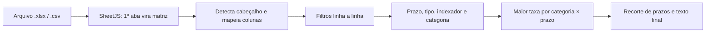

# Mesa XP

As ferramentas da mesa num link só: **Ordens**, **Renda Fixa** e **Calendário**, em abas, com o
mesmo visual e o mesmo tema claro/escuro.

| Aba | Para quê | Atalho |
| --- | --- | --- |
| **Ordens** | Transformar a solicitação do cliente, colada do grupo, nas ordens de renda variável nos 4 formatos do back office | Alt + 1 |
| **Renda Fixa** | Ler a planilha de renda fixa da XP e montar a mensagem de WhatsApp com as maiores taxas por prazo | Alt + 2 |
| **Calendário** | Marcar quem vai estar presencial em cada dia, com observações e horários indisponíveis | Alt + 3 |

Cada aba tem link próprio: `…/#ordens`, `…/#rendafixa`, `…/#calendario`.

Junta três projetos que existiam separados — `Ordens.XP`, `RendaFixaDisparo` e `Calendario.Mesa` —
sem mudar o que cada um faz.

## Ordens

Gerador de ordens de renda variável para back office. Você cola a solicitação do cliente como ela
chegou — texto corrido, print transcrito, tabela de posições, ou o pedaço da conversa do grupo com
carimbo e tudo —, confere o que o sistema entendeu, e copia a saída pronta.

### Os 4 formatos

| Formato | Para quê | Saída |
| --- | --- | --- |
| **Ordem por E-mail** | pedir confirmação da execução ao cliente | texto |
| **E-mail em tabela** (auditoria) | o e-mail da ordem com a tabela do Lote Simples no corpo; ganha a coluna `Financeiro` quando a cesta é em reais, e vira duas tabelas quando mistura reais e quantidade | tabela em grade (+ texto com TAB) |
| **Lote Simples** | colar na planilha de lote | TSV |
| **Lote TWAP** | colar na planilha de TWAP | TSV |

Os TSVs usam TAB real e colam direto em Excel e Planilhas Google, uma coluna por campo.
A especificação literal de cada formato está em [`docs/FORMATOS-DE-SAIDA.md`](docs/FORMATOS-DE-SAIDA.md).

### O princípio

O sistema **não adivinha**. Preço não informado sai como `A mercado`; qualquer outro dado crítico
que falte bloqueia a geração e mostra o que falta. Ticker parecido com erro de digitação pede
confirmação, nunca corrige sozinho — a lista das 1.624 ações, FIIs, BDRs e ETFs da B3 está embutida
justamente para pegar um `KCNR11` no lugar de `KNCR11`. Ativo repetido não é somado sozinho.

Antes de gerar qualquer saída, um preview mostra o que foi interpretado, campo a campo, para você
corrigir na mão o que for preciso. Quase todo bloqueio tem um botão de confirmar ao lado: ele te
obriga a olhar, nunca te deixa sem saída. Os que não têm apontam a saída: escolher o fundo certo, ou
trocar para o formato que comporta a ordem.

### O que ele não faz

Estes casos continuam sendo feitos à mão, e o sistema os lista com o motivo em vez de tentar
adivinhar: ordem sem quantidade nem valor (`V - HGCR11 (Total)`) e Push, que é do Hub.

Fundos cetipados (sem ticker, identificados pelo nome) **são atendidos**, pelo mesmo modelo de
e-mail das ações, inclusive com o valor na linha de baixo do nome. Lote, TWAP e o E-mail em tabela
não: a coluna `Ativo` precisa de um código.

### Cole direto do WhatsApp

Pode colar o pedaço da conversa como ele está. O carimbo `[13:46, 21/09/2026] Fulano:`, os
telefones e os "Enviado mesa." são descartados — e o horário do carimbo nunca vira horário de
ordem. Duas contas no mesmo bloco viram duas solicitações separadas.

### Uso

1. Cole a solicitação na área de texto.
2. Escolha o formato de saída, ou deixe a detecção automática por palavras-chave sugerir:
   `via email` marca os dois e-mails (texto e tabela; com fundo cetipado na cesta, só o texto),
   `auditar` marca só a tabela, e `lote` e `twap` marcam os seus.
3. Confira o preview e corrija o que estiver errado. O `×` tira uma linha; o **+ Adicionar ativo**
   acrescenta uma em branco, para preencher à mão.
4. Resolva os bloqueios, se houver.
5. Copie. E-mail e lote podem ser gerados na mesma passada, sem redigitar nada.

As últimas ordens geradas ficam no histórico local do navegador (`localStorage`), para reabrir e
reaproveitar.

Atalhos (só com a aba Ordens aberta): **Ctrl + Enter** analisa, **Alt + H** abre o histórico,
**Esc** fecha o histórico.

## Renda Fixa

Encontra a maior taxa de renda fixa por prazo numa planilha exportada da XP e monta a mensagem
pronta para o WhatsApp. Você solta a planilha e a página:

1. lê todos os ativos no próprio navegador;
2. descarta o que não serve ao público-alvo (liquidez diária, investidor qualificado, PU alto,
   prazos quebrados…);
3. escolhe a **maior taxa** de cada prazo em cada categoria (pré, pós, IPCA+ e isentos);
4. gera o texto formatado para WhatsApp, pronto para copiar e colar.

A planilha **nunca sai do seu computador**: todo o processamento é local, e o histórico fica no
navegador.

### Exemplo de saída

Gerado a partir de `produtos-renda-fixa-emissao-bancaria (2).xlsx` (modo Emissão Primária, em 23/09/2026):

```text
*Oportunidades de RENDA FIXA hoje!* ⭐

*Taxas pré fixadas:*
-> 1 ano - CDB 14,20% a.a.
-> 2 anos - CDB 14,30% a.a.
-> 3 anos - CDB 14,55% a.a.
-> 4 anos - CDB 14,55% a.a.
-> 5 anos - CDB 14,60% a.a.

*Taxas Pós-fixadas:*
-> 2 anos - CDB 105% CDI
-> 4 anos - CDB 106,50% CDI
-> 6 anos - CDB 103% CDI

*Taxas IPCA+:*
-> 1 ano - CDB IPCA + 6,60% a.a.
-> 2 anos - CDB IPCA + 8,40% a.a.
-> 3 anos - CDB IPCA + 8,15% a.a.

*LCAs/LCIs ISENTA DE IR*
-> 1 ano – LCA 10,95% a.a.
-> 2 anos – LCA 11,83% a.a.
-> 3 anos – LCA 12,12% a.a.
-> 2 anos – LCA 89% CDI
-> 2 anos – LCA IPCA +5,20%
```

No modo **Mercado Secundário** o título ganha `(MERCADO SECUNDÁRIO)` e cada linha termina com o emissor, por exemplo `-> 2 anos - CDB 121% CDI (DIGIMAIS)`. Um título de CDI + spread aparece como `-> 2 anos - CDB CDI + 0,80% a.a.`

### Como usar

1. Solte a planilha (`.xlsx`, `.xls` ou `.csv`) em qualquer lugar da aba Renda Fixa, ou clique em
   “Arraste a planilha aqui”.
2. Em **Mercado**, escolha **Emissão primária** ou **Mercado secundário**. A planilha é reprocessada
   na hora.
3. Confira os **Cartões** (maior taxa de cada prazo, com a variação ▲/▼ desde a última análise
   salva antes de hoje) ou a **Mensagem**, como ela vai chegar no WhatsApp.
4. **Copiar mensagem** coloca o texto na área de transferência. **Salvar** guarda a análise no
   histórico, que também serve de base para as variações do dia seguinte.

O **Funil da análise** mostra quantas linhas foram lidas, quantas ficaram de fora e por quê, e
quais colunas da planilha foram usadas.

| Tecla (com a aba Renda Fixa aberta) | Ação |
|---|---|
| `A` | Abrir planilha |
| `M` | Alternar mercado primário / secundário |
| `V` | Alternar cartões / mensagem |
| `C` | Copiar mensagem |
| `S` | Salvar no histórico |
| `T` | Alternar tema claro / escuro |
| `?` | Mostrar a lista de atalhos |

### Histórico e variações

**Salvar** grava a análise em `localStorage`, na chave `rendafixa_history`, com no máximo 20 registros (o mais recente primeiro). Cada registro guarda o texto, os totais, o mercado, o nome do arquivo e as taxas de cada prazo em forma compacta.

Nos cartões, cada taxa mostra a variação (▲/▼, em pontos percentuais) em relação à **última análise salva antes de hoje no mesmo mercado**. Passe o mouse sobre a variação para ver a taxa anterior e a data. Salvar todo dia mantém essa comparação útil.

O histórico existe só naquele navegador e perfil: limpar os dados do site apaga tudo.

### Planilha de entrada

O motor foi calibrado para a exportação **"Produtos de Renda Fixa – Emissão Bancária" da XP** (`produtos-renda-fixa-emissao-bancaria.xlsx`, aba "Resultado", 34 colunas). As exportações reais desse relatório servem de teste (em `src/modulos/rendafixa/fixtures/`, fora do git).

- Apenas a **primeira aba** é lida.
- O **cabeçalho é detectado sozinho**: entre as 15 primeiras linhas, vence a que mais contém as palavras *taxa, ativo, instrumento, vencimento, rentabilidade, juros*. Logos e avisos acima dele são ignorados.
- As colunas são reconhecidas pelo nome, sem acento e sem diferenciar maiúsculas. Quando mais de uma coluna combina, vale a **última**, exceto em *taxa*, onde vale a **primeira**. O quadro **Funil → Colunas usadas** mostra o mapeamento aplicado.

| Campo | Cabeçalhos reconhecidos (contém…) | Coluna usada na planilha da XP |
|---|---|---|
| tipo | `tipo`, `ativo`, `produto` ou exatamente `ticker` | **Ticker** (B) |
| instrumento | `instrumento` | Instrumento (C) |
| taxa | `tax.min`, `tax.max`, `taxa`, `rentabilidade` | **Tax.Mín** (M) |
| indexador | `indexador`, `indice`, `remuneracao`, `benchmark`, `referencia` | Indexador (D) |
| vencimento | `vencimento`, `prazo`, `vertice` | Vencimento (L) |
| emissão | `data de emissao`, ou `emissao` sem `taxa` | Data de Emissão (AC) |
| público | `publico`, `alvo`, `destinatario`, `investidor` | Público (AD) |
| liquidez | `liquidez`, `carencia` | Carência (AG) |
| isento | começa com `isento`, ou contém `isencao` | Isento (I) |
| emissor | `emissor`, `banco`, `instituicao`, `contraparte` | *(não existe; vem do nome do Ativo)* |
| PU | `pu`, `p.u`, `unitario` | *(não existe)* |

> A taxa comparada é a **Tax.Mín**, não a Tax.Máx. A primeira coluna da planilha (Ativo, ex.: `CDB PINE - ABR/2033`) é usada como nome do ativo nos cartões e no quadro de bloqueados, e para extrair o emissor.

## Renda Fixa: como o motor funciona



Toda a regra fica em `src/modulos/rendafixa/motor.js`: `processRows` analisa e `montarTexto` gera a mensagem.

### 1. Filtros (em ordem)

Cada linha descartada entra na lista **"Por que N linhas ficaram de fora"** do funil.

| # | Regra | Detalhe |
|---|---|---|
| 1 | Mercado | Linha com **Data de Emissão preenchida = secundário**. O modo primário descarta essas linhas; o secundário descarta as demais. |
| 2 | PU acima de R$ 1.300 | Aparece no quadro "Ativos bloqueados". |
| 3 | Público restrito | Público contém "qualificado" ou "profissional". Também aparece no quadro. |
| 4 | Liquidez diária | Liquidez contém "Diária" (com ou sem acento) ou é "D+0". |
| 5 | Sem taxa | Taxa ausente ou ≤ 0. Antes de desistir, procura qualquer célula da linha com "%". |
| 6 | Prazo quebrado | Fora da janela de arredondamento (item 3). |
| 7 | Tipo desconhecido | Não é CDB, LCA, LCI, LCD, LC, LF, CRI, CRA ou Debênture. Procura na coluna *tipo*, depois em *instrumento*, depois nas 5 primeiras células. |
| 8 | Isento fora das regras | Isento pré com prazo > 3 anos, ou atrelado a CDI/IPCA com prazo diferente de 2 anos. |

### 2. Leitura da taxa

| Texto na célula | Valor guardado | Significado |
|---|---|---|
| `14,55%` | 14,55 | % ao ano (pré) |
| `105% CDI` | 105 | % do CDI (pós) |
| `CDI + 0,80%` | 0,80 | spread sobre o CDI (pós, indexador CDI+) |
| `IPC-A + 7,85%` | 7,85 | spread sobre o IPCA (aceita `IPC-A` e `IPCA`) |
| `0,1455` (número) | 14,55 | célula formatada como porcentagem |
| `1,05` (número, indexador % CDI) | 105 | 105% do CDI em célula de porcentagem |

Números aceitam formato brasileiro e americano (`1.250,00` e `1,250.00`).

### 3. Prazo em anos cheios

O prazo é a diferença em dias entre **hoje** e o vencimento. O ativo só entra se estiver perto de um ano cheio: **N anos = de 365·N − 95 até 365·N + 15 dias**. Prazos intermediários (ex.: 1 ano e 4 meses) e vencimentos a menos de 270 dias são descartados.

| Vértice | Dias até o vencimento aceitos |
|---|---|
| 1 ano | 270 a 380 |
| 2 anos | 635 a 745 |
| 3 anos | 1.000 a 1.110 |
| N anos | 365·N − 95 a 365·N + 15 |

Também aceita número de dias (`720`), texto (`720 dias`, `24 meses` com mês de 30 dias, `2 anos`) e datas (`dd/mm/aaaa` ou `aaaa-mm-dd`).

> Como o prazo depende da data de hoje, a mesma planilha processada semanas depois gera outros vértices. Use sempre a exportação do dia.

### 4. Indexador e categoria

O indexador vem da coluna Indexador e do texto da taxa. Se não houver pista neles, a página procura IPCA ou CDI nas 15 primeiras células da linha. Sem nada disso, o título é tratado como pré-fixado.

| Categoria | Critério (nesta ordem) |
|---|---|
| Isento | Tipo LCA, LCI, LCD, CRI ou CRA, **ou** coluna Isento = "S". Subdividido em pré, CDI ou IPCA. |
| IPCA+ | Indexador IPCA. |
| Pós-fixado | Indexador % do CDI ou CDI + spread. |
| Pré-fixado | Todo o resto. |

### 5. Vencedor e recorte

Para cada categoria × prazo sobrevive só o ativo de **maior taxa** (em caso de empate, fica o primeiro da planilha). LCA, LCI e LCD disputam a mesma vaga. % do CDI e CDI + spread não são comparáveis sem uma projeção do CDI, então **% do CDI sempre tem prioridade**, e o CDI + spread só aparece quando é a única opção pós-fixada daquele prazo. Depois, só alguns prazos entram no texto:

| Seção | Prazos exibidos |
|---|---|
| Pré-fixadas | 1 a 5 anos |
| Pós-fixadas | 2, 4 e 6 anos |
| IPCA+ | 1 a 3 anos |
| Isentos pré | 1 a 3 anos |
| Isentos CDI e IPCA | 2 anos |

### 6. Emissor (só no secundário)

No modo secundário cada linha mostra o emissor entre parênteses. Ele vem da coluna de emissor, se existir. Se não existir, é extraído do nome do ativo (`CDB PINE - ABR/2033` → `PINE`, removendo "BANCO", "S/A", "S.A." e "SA"). Em último caso, a página procura uma lista fixa de bancos conhecidos (XP, BTG, Pine, Master, Fibra, C6…). No modo primário o emissor é omitido.

### Funil

| Etapa | O que conta |
|---|---|
| Linhas lidas | Linhas com dados abaixo do cabeçalho |
| No mercado escolhido | As que pertencem ao mercado do seletor |
| Passaram nos filtros | As que disputam a maior taxa de cada prazo |
| Na mensagem | As linhas que aparecem no texto final |

A diferença entre as etapas é explicada linha a linha em "Por que N linhas ficaram de fora", que inclui também as linhas **superadas por taxa maior** e as **fora dos prazos da mensagem**.

## Calendário

Planilha semanal de presença da equipe:

- **Semana**: uma linha por colaborador e uma coluna por dia útil, com o total de presenciais de
  cada dia no rodapé. Clique numa célula para marcar presencial, escrever uma observação e
  registrar horários indisponíveis com o motivo. Navegue entre semanas ou volte para **Hoje**.
- **Histórico**: o mês agrupado por semana, com o resumo de presenças e ausências parciais e filtro
  por colaborador.
- **Tempo real**: o que outra pessoa grava aparece sem recarregar a página. O status no topo diz se
  a atualização ao vivo está ligada.

O Calendário **precisa de internet**: os dados ficam no Supabase, compartilhados pela equipe. Sem
conexão, o erro aparece na tela, com o botão “Tentar de novo” — nada é gravado escondido só no seu
navegador.

### Configurando o banco

O Calendário usa o projeto Supabase da mesa por padrão. Para apontar para outro, defina no build
(no Netlify, em *Site configuration → Environment variables*; localmente, num arquivo `.env`):

```bash
VITE_SUPABASE_URL=https://<projeto>.supabase.co
VITE_SUPABASE_ANON_KEY=<chave anon public>
```

As duas **vazias** ligam o **modo local**: os dados ficam só no navegador de cada pessoa
(`localStorage`), útil para testar sem banco. Só uma delas vazia é erro de configuração e aparece
na tela.

Para criar um projeto novo: no Supabase, abra o **SQL Editor**, cole o conteúdo de
[`supabase/schema.sql`](supabase/schema.sql) e execute; depois copie a *Project URL* e a chave
*anon public* (em **Project Settings → API**) para as variáveis acima.

Projetos do plano gratuito do Supabase são **pausados** depois de alguns dias sem uso, e o endereço
deixa de responder. Se o Calendário mostrar “Sem conexão com o banco de presença” com a internet
funcionando, confira no painel do Supabase se o projeto está pausado e retome-o.

### Segurança — pendência

**O Calendário ainda não tem login**, e as políticas do banco liberam leitura e escrita de tudo para
quem tem a chave anon — que vai no próprio site e está neste repositório público. Qualquer pessoa
com o link pode ver, alterar e apagar os registros, que têm nomes e motivos de ausência (às vezes de
saúde). Trate o link como interno e evite detalhe de saúde no motivo.

A correção está planejada para a fase 2: login pelo Supabase Auth, políticas fechadas para a equipe
e repositório privado. Detalhes em [`CLAUDE.md`](CLAUDE.md#pendência-de-segurança--fase-2).

## Modo claro e escuro

O botão no canto superior direito alterna os dois, para as três abas. **Navegador novo abre sempre
no escuro**, e a partir do seu primeiro clique vale a sua escolha, gravada naquele navegador.

Os dois modos foram calibrados para quem passa o dia na ferramenta: sem preto puro no fundo, sem
branco puro no texto, contraste na faixa confortável em vez do máximo, cor saturada só onde ela
significa alguma coisa. As animações são curtas e somem por completo se o sistema estiver
configurado para reduzir movimento.

## Como rodar

```bash
npm install
npm run dev      # servidor local de desenvolvimento
npm test         # testes
npm run build    # gera dist/index.html, um arquivo só
npm run verificar  # abre o dist/index.html no Chromium e confere as três abas (Playwright)
```

Requer Node 22+.

### Usar sem instalar nada

`npm run build` gera **um único arquivo**, `dist/index.html`, com o JS, o CSS e o ícone dentro dele.
Abre com dois cliques, sem servidor e sem Node, e pode ser copiado para outra pasta, um pendrive ou
a rede. **Ordens e Renda Fixa funcionam sem internet** nesse arquivo; o Calendário precisa de
conexão com o banco.

O `index.html` da raiz do projeto **não** funciona aberto com dois cliques: é a fonte que o Vite lê.

### Deploy

Netlify, já configurado em `netlify.toml`: build `npm run build`, publica `dist/`, Node 22 e
redirecionamento de todas as rotas para o `index.html`. Qualquer host de estáticos serve igual.

## Privacidade

- **Ordens e Renda Fixa** rodam inteiros no navegador: nenhum dado de cliente nem planilha sai da
  máquina. Não há backend, telemetria nem chamada de rede nessas abas; os históricos ficam no
  `localStorage` do navegador.
- **Calendário** grava no Supabase — veja a pendência de segurança acima.

## Estrutura

```
index.html                 a casca: topo, abas e as três seções
src/main.js                liga tema, abas e o início de cada ferramenta
src/shell/                 rotas e atalhos das abas
src/ui/                    tema, avisos, escape de HTML, tokens e componentes compartilhados
src/modulos/ordens/        parsing, validação e formatação (core/), preview e saídas (ui/), histórico
src/modulos/rendafixa/     motor, leitura da planilha, histórico, tela; fixtures/ e golden/ dos testes
src/modulos/calendario/    repositório e adaptadores (Supabase e local), datas, tela
src/vendor/                SheetJS 0.20.1 (licença Apache 2.0)
supabase/schema.sql        tabelas, políticas e Realtime do Calendário
docs/                      formatos de saída do Ordens; roadmap e sugestões
scripts/                   atualizar tickers e fundos, gerar os goldens, verificar no navegador
```

São 586 testes. Os do Renda Fixa comparam o motor com o do RendaFixa Pro original em planilhas reais
da XP, que por serem da XP não estão no repositório: sem elas, esses testes são pulados e só roda o
da planilha sintética.

Convenções e regras de negócio para quem (ou o que) for mexer no código: [`CLAUDE.md`](CLAUDE.md).
Defeitos conhecidos, sugestões e próximos passos: [`docs/ROADMAP.md`](docs/ROADMAP.md).

## Tecnologias

- HTML, CSS e JavaScript puro em módulos ES, empacotados pelo [Vite](https://vite.dev) num arquivo
  só; testes com [Vitest](https://vitest.dev).
- [SheetJS](https://sheetjs.com) 0.20.1, vendorizado em `src/vendor/` (licença Apache 2.0).
- [@supabase/supabase-js](https://github.com/supabase/supabase-js) para o Calendário (Postgres +
  Realtime).
